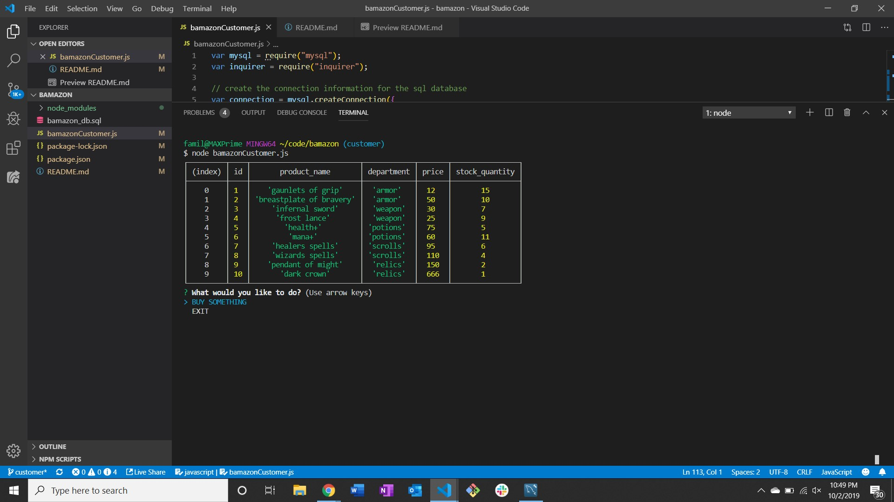

# Fantasy Bamazon
While using your Amazon app a mysterious incident pulled you into a world filled with fantasy and magic.
In order to prepare you should equip yourself with some new gear. Check out the Fantasy Bamazon shop for your adventuring needs.

# Intro
The user interacts with a database built in mysql through node.js

## Beginning steps
Once the user starts the application they're greeted with a table of the items in the faux shop and the choice to "buy something" or "exit"

