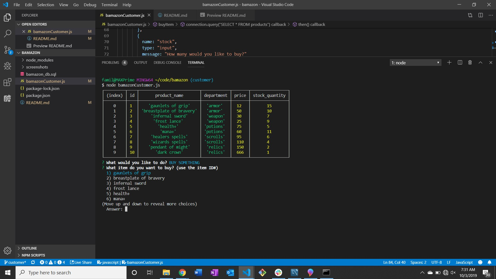
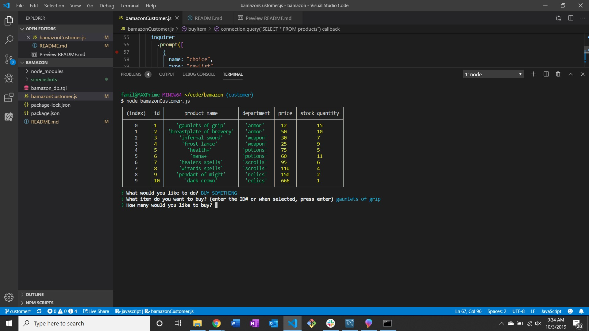
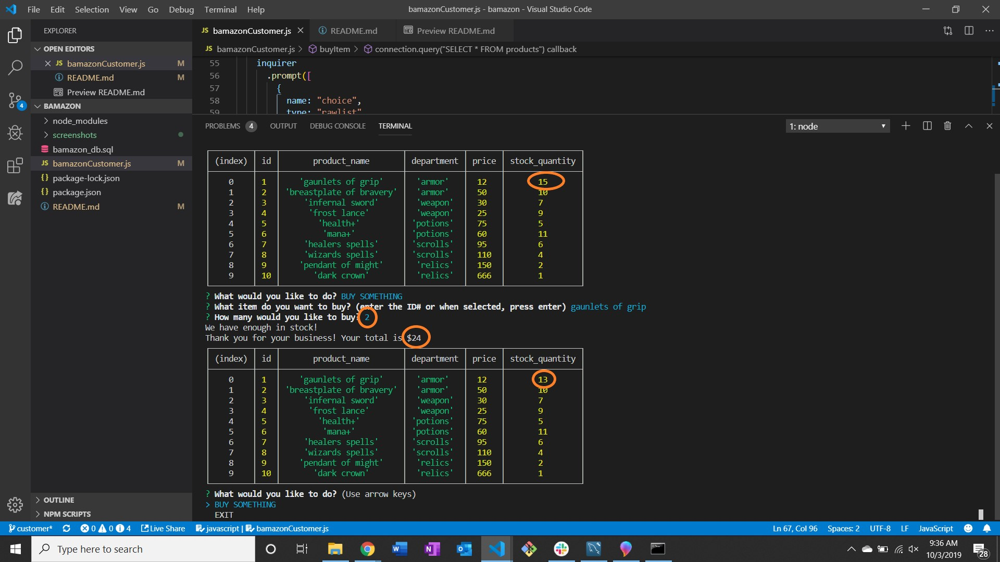
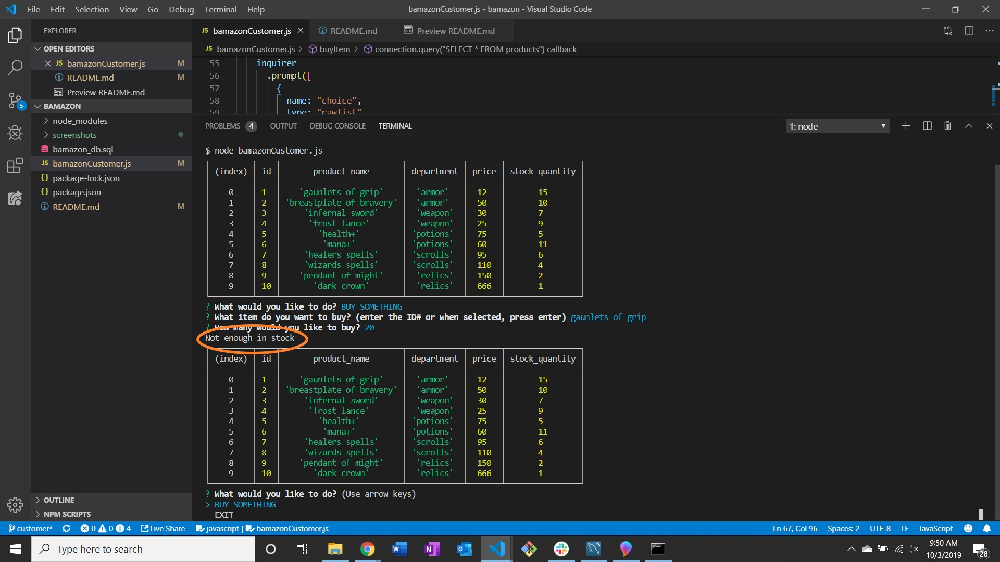

# Fantasy Bamazon
While using your Amazon app a mysterious incident pulled you into a world filled with fantasy and magic.
In order to prepare you should equip yourself with some new gear. Check out the Fantasy Bamazon shop for your adventuring needs.

# Intro
The user interacts with a database built in mysql through node.js

## Beginning steps
Once the user starts the application they're greeted with a table of the items in the faux shop and using the arrow keys the user selects their choice choice to "buy something" or "exit"

 

Assuming they select "buy something" the user is then given the message to choose from the items in the selection and the choices appear to cycle through and then the user will either enter the ID# of the product or press enter on the highlighted item of their choosing

 

## Buying your product
Once the user has made their choice they're prompted with a message asking how many of the selected items do they want?

## Finished purchase
When the user has made their choice, if there's enough of the item in stock, they're prompted with a message stating there's enough in stock and how much their purchase is. Also, you can see the quantity in the store update with the purchase.

## Not enough stock
If the user chooses a quantity that exceeds the amount in stock, the user is prompted with a message saying "not enough in stock"
